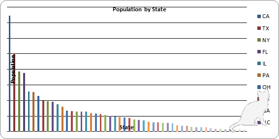

# Python自動化ハンズオン
目的：Web上のデータを自動でグラフ化するツールを作成する
狙い：「Web上のデータ」を自分の業務上で取り扱うデータに置き換えると、同様の自動化ツールが完成する

## 演習課題

1. Web上のデータをダウンロードする（12章　Webスクレイピング）
   

[基本]
テキスト本書のサンプルCSVファイル
https://github.com/oreilly-japan/automatestuff2-ja/blob/main/ch16/example.csv

[応用]
COVID19にまつわる政府提供オープンCSVファイル
https://www.mhlw.go.jp/stf/covid-19/open-data.html


1. 1.で取得したデータをExcelファイルにして自動でグラフ化する（13章　Excelスプレッドシートの操作）

※②はチャレンジ課題。基本は①までを完成することを目標とする。

3. 2で出力したグラフの画像の隅に自社のロゴを追加する（19章　画像の操作）

※今後の発展として紹介するのみとし、演習は実施しない（恐らくそこまで行ける人はいない）

## 環境準備

```bash
# requirements.txtに記載されたライブラリをインストール
$pip install -r requirements.txt
```

## 実行方法

```bash
# srcディレクトリに移動
$cd src

# 1.Web上のデータをダウンロードを実行
$python scraping.py

# 2.Excelファイルを自動でグラフ化する
$python excel_graph.py

# 3. Excelファイルから画像を取得する。
$python export_excel_graph.py

# 4. 画像にロゴを追加する
$python add_logo.py
```

## 実行例

```powershell
PS C:\Users\critt\Tutorials\veriserve-python\src> python .\scraping.py
dl_censuspopdata.xlsxをダウンロードしました。
PS C:\Users\critt\Tutorials\veriserve-python\src> python .\excel_graph.py
ワークブックを開いています...
各州の人口を集計しています...
新しいシートを作成しています...
棒グラフを作成しています...
population-20250305.xlsxを保存しました。
PS C:\Users\critt\Tutorials\veriserve-python\src> python .\export_excel_graph.py
Excelを使用してチャートを画像としてエクスポートしています...
graph.pngとしてチャート画像をエクスポートしました。
PS C:\Users\critt\Tutorials\veriserve-python\src> python .\add_logo.py          
ロゴを追加中 graph.png...
graph.pngにロゴを追加完了しました。
出力先: withLogo/graph.png
```

## 実行結果


